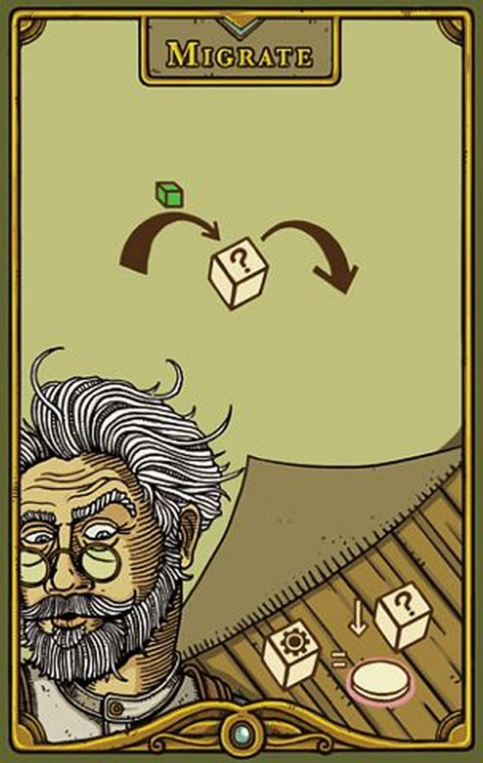

# Feudum 日本語ドキュメント制作

ボードゲーム **Feudum**（Mark Swanson / Odd Bird Games, © 2017）の英語版ルールブックを起点に、日本語ルールブックと攻略冊子を制作するプロジェクトです。

個人利用を目的とした**非公式の翻訳**です。ゲームそのものの権利は Odd Bird Games にあります。

## 公開サイト

`docs/` の原稿から静的サイトを生成し、GitHub Pages で配信しています。`main` に push すると
`.github/workflows/pages.yml` が `scripts/build_site.py` を実行して公開されます。
Python の標準ライブラリだけで動くので、依存のインストールはありません。

手元で確認する場合は次のとおりです。

```
python3 scripts/build_site.py && open dist/site/index.html
```

### このリポジトリに含めていないもの

公開範囲を成果物だけに絞るため、次は `.gitignore` で除いています（手元には残ります）。

| 除いたもの | 理由 |
| --- | --- |
| `source/` | 原書PDFと、そこから機械抽出したテキスト・ページ画像・埋め込み画像601点 |
| `reference/feudum-rulebook-en.md`、`feudum-glossary-en.md` | 原文の書き起こし。翻訳作業用で、読者向けの成果物ではない |
| `figures/icons/`、`figures/nice/`、`figures/web/` | 図版の素材置き場。ここから生成した `figures/` 直下のファイルだけを公開する |
| `work/`、`dist/` | 中間成果物とビルド成果物（サイトは Actions が生成する） |

そのため、クローンした環境で `scripts/compose_figures.py`、`place_nice_figures.py`、
`enhance_embedded.py`、`build_figures.py` は動きません。素材が必要な処理はローカル専用です。
`build_site.py` と A4版のビルドは、リポジトリの内容だけで動きます。

## ディレクトリ構成

```
feudum/
├── source/      ① 元データ（原典と機械抽出物。基本的に触らない）
├── reference/   ② 翻訳の基準（英語版構造化テキスト・用語集）
├── work/        ③ 中間成果物（章別ソース・作業メモ）
├── figures/     ④ 図版素材（原書から切り出した画像18点）
├── scripts/     ⑤ ビルドスクリプト
├── docs/        ⑥ 完成原稿（Markdown・編集対象）
└── dist/        ⑦ 生成物（HTML・配布対象）
```

| 種別 | ディレクトリ | 中身 |
| --- | --- | --- |
| **元データ** | `source/` | `feudum.pdf`（原典）と `extracted/`（PDFから機械抽出したテキスト・ページ画像・埋め込み画像。すべて再生成可能） |
| **中間成果物** | `reference/` `work/` `figures/` | 翻訳の基準ファイル、章別の翻訳ソース、切り出した図版 |
| **成果物** | `docs/` `dist/` | 完成した日本語原稿（md）と、そこから生成した配布用HTML |

---

## ファイル一覧

### ① source/ — 元データ

| パス | 内容 |
| --- | --- |
| `feudum.pdf` | 原典。13シート（A4表紙＋A3見開き11＋A4裏表紙）＝印刷ページ1〜25 |
| `extracted/text-layout.txt` | `pdftotext -layout` の生出力（段組みの位置関係が残る） |
| `extracted/text-raw.txt` | `pdftotext` の生出力（読み順は崩れるが本文が連続する） |
| `extracted/pages/spread-NN.png` | 各シートを200 dpiでレンダリングした見開き画像（13枚・45MB） |
| `extracted/embedded/img-*.png` | PDFに埋め込まれた画像素材の全抽出（640ファイル）。`-NNN` はページ番号 |
| `extracted/region-tile-chart-crop.png` | 地域タイル表を400 dpiで拡大した記録（元画像が75 ppiのため判読不能なことの証跡） |

### ② reference/ — 翻訳の基準

| パス | 内容 |
| --- | --- |
| `feudum-rulebook-en.md` | 英語ルールブックの構造化Markdown。多段組みの読み順を再構成した全文 |
| `feudum-glossary-en.md` | 背景情報＋用語集（英語）。文体・定型表現・ゲーム構造・全用語の定義 |
| `feudum-glossary-ja.md` | 上記の日本語版。**訳語決定表**を含む翻訳の基準ファイル。付録C1に決定済み訳語の一覧と理由 |

### ③ work/ — 中間成果物

| パス | 内容 |
| --- | --- |
| `rulebook-ja-parts/part-1〜7.md` | 日本語ルールブックの章別ソース（並列翻訳の分担単位）。結合前の部分編集用 |
| `build-notes.md` | 抽出・翻訳作業の記録（品質チェック結果、判読できなかった情報など） |

### ④ figures/ — 図版素材

原書から切り出したJPEG 18点。`scripts/build_figures.py` が `source/extracted/pages/` から生成します。

| 配置先 | ファイル | 内容 |
| --- | --- | --- |
| 表紙 | `fig-cover.jpg` | 原書の表紙アート |
| §2 | `fig-board.jpg` | ゲームボードの構成 |
| §3 | `fig-components.jpg` | コンポーネント一覧 |
| §5 | `fig-setup.jpg` | セットアップ図①〜⑳ |
| §9.1〜9.3 | `fig-pawns.jpg` `fig-routes.jpg` `fig-roles.jpg` | ポーン6種／乗り物ルート／支配者・農奴・臣民 |
| §9.4 | `fig-locations.jpg` `fig-tilechart.jpg` `fig-military.jpg` `fig-landscapes.jpg` | 拠点4種／地域タイル表／投石機スペース／地形4種 |
| §9.8〜9.11 | `fig-conquer.jpg` `fig-defend.jpg` `fig-payment.jpg` | 征服の例／防御の例／支払いの例 |
| §10〜11 | `fig-guildtrack.jpg` `fig-krud.jpg` `fig-serpent.jpg` | ギルドトラック／クルド樽／シーサーペント |
| §17 | `fig-writs.jpg` | 王命状カード全16枚 |

図版内の文字は原書のまま英語です。意味はキャプションと本文で補っています。

### アイコン素材（figures/icons/）

原書PDFに埋め込まれた画像を、アイコンとして使える形に加工したものです。`python3 scripts/enhance_embedded.py` で生成します。

- 色を4倍に拡大（Lanczos）→ Kuwaharaフィルタで平坦部のJPEGノイズを均す → 輪郭を締める
- 透過マスク（元PDFでは色の2倍の解像度で入っている）を重ねて背景を抜き、余白を切り詰める
- 22px未満・ほぼ単色・重複を除外
- `figures/icons/index.html` に一覧が出ます。使うものを `figures/` へ用途名でコピーしてください

**元画像は75 ppi なので、文字や数字は加工しても判読できません。** 拡大したときのにじみとブロックノイズを抑える処理であり、情報を復元するものではありません。

### 画像スロットの仕組み

『はじめてガイド』と『リファレンス』には、**まだ用意していない画像の置き場所**が埋め込んであります。

```markdown

```

- `figures/` に同名ファイルが**あれば画像として埋め込まれ**、**なければ点線の枠**が描かれます
- 画像を置くだけで反映されるので、原稿の修正は不要です
- サイズは `full`（版面幅100%）／`wide`（68%）／`half`（52%）／`small`（30%）

**用意すべき画像の一覧と仕様は [`figures/MANIFEST.md`](figures/MANIFEST.md) にまとめています**（現在34点が未配置）。撮影が必要なものも同ファイルに記載しています。

### ⑤ scripts/ — ビルド

| パス | 内容 |
| --- | --- |
| `mdbook.py` | 共通部品。Markdown→HTML変換とA4印刷用CSS。他のビルダーが読み込む |
| `build_site.py` | **Web版サイト**を生成。章分割・サイドバー・全文検索・相互リンク |
| `site_assets/site.css` `site_assets/site.js` | サイトのスタイルとスクリプト（ビルド時にコピー） |
| `build_figures.py` | 図版18点を切り出す。座標は `CROPS`（原書のポイント単位）で定義 |
| `enhance_embedded.py` | 原書PDFの埋め込み画像を**アイコン素材**に加工（拡大・ノイズ除去・透過復元）。→ `figures/icons/` |
| `build_rulebook_html.py` | ルールブックHTMLを生成。図版の配置は `FIGURES`（見出しid → 図版・キャプション・サイズ）で定義 |
| `build_glossary_html.py` | 用語集HTML（別冊）を生成。`reference/feudum-glossary-ja.md` の第2部から本編と英日索引を組む |

### ⑥ docs/ — 完成原稿

| パス | 内容 |
| --- | --- |
| `feudum-firstguide-ja.md` | **はじめてガイド**。初プレイヤーがプレイ前に読む全体像。7章＋早見（A4で4〜5ページ） |
| `feudum-rulebook-ja.md` | **日本語ルールブック**。全20章・原文を省略なく訳出 |
| `feudum-strategy-ja.md` | **攻略冊子『追放者の手引き』**。2〜4回目の初級〜中級者向け。序章＋全11章＋終章＋付録A/B |
| `feudum-reference-ja.md` | **リファレンス**。要素別の一覧＋詳細（アクション11種・6ギルド・王命状16枚ほか。A4で11ページ） |

4冊は用途で役割を分けています。**はじめてガイド**＝1回目のプレイ前（全体像だけ、数値は出さない）、**ルールブック**＝手順を通して読む、**リファレンス**＝卓上で要素を引く、**追放者の手引き**＝2回目以降の勝ち方。用語はすべて共通です。

用語集の原稿は `reference/feudum-glossary-ja.md` です。翻訳作業用の情報（文体方針・定型表現・訳語の決定記録）を含むため `reference/` に置き、冊子化の際はその第2部（B1〜B23）だけを使います。

### ⑦ dist/ — 生成物

| パス | 内容 | 構成 |
| --- | --- | --- |
| `feudum-rulebook-ja.html` | **ルールブック**・28ページ・2.6MB（図版18点をbase64で埋め込んだ単一ファイル） | 表紙 → 目次 → サマリー → 本文（第1〜20章） |
| `feudum-glossary-ja.html` | **用語集（別冊）**・18ページ・72KB | 表紙 → 目次 → この冊子について → 本編23分類 → 英日索引196語 |
| `site/` | **Web版ドキュメントサイト**・39ページ | 入口 → 5冊（ルールブックと攻略冊子は章ごとに分割） |

用語集はルールブックから分離した独立冊子です。ルールブックを読む人と、英語版と読み比べる人で必要な場面が違うため、別々に印刷・配布できる形にしています。

---

## ビルド手順

必要ツール: `poppler`（`brew install poppler`）、Python 3 ＋ Pillow

```sh
# 図版の生成（source/extracted/pages/ から切り出し）
python3 scripts/build_figures.py

# A4印刷版
python3 scripts/build_rulebook_html.py   # → dist/feudum-rulebook-ja.html
python3 scripts/build_glossary_html.py   # → dist/feudum-glossary-ja.html

# Web版サイト
python3 scripts/build_site.py            # → dist/site/
open dist/site/index.html                # ブラウザで開く（file:// のままで動きます）
```

### Web版サイトについて

- `docs/*.md` と `reference/feudum-glossary-ja.md` を出典に、**39ページの静的サイト**を生成します。A4版とは独立していて、原稿を直せば両方に反映されます。
- ルールブック（20章）と攻略冊子（15章）は**章ごとに分割**、リファレンス・はじめてガイド・用語集は1ページのままです。
- **全文検索**はサイドバーの入力欄から。`/` キーでフォーカスします。インデックスはJS形式なので `file://` で開いても動きます。
- 本文中の「（→ 16 ページ「ギルド加入」）」は、**該当章へのリンクに自動変換**されます（現在43箇所）。
- 右上のボタンで**ライト／ダーク**を切り替えます（設定はブラウザに保存）。
- 画像は `figures/` をコピーして参照します。未配置の画像は点線の枠で表示されます。

- 文字サイズは各ビルダーの `FONT_SCALE`（現在 `0.75`）で一括変更できます
- 改ページする章は `NEWPAGE`（現在 §1・5・9・10・12・17・18）で指定します
- 印刷: ブラウザで開き、A4・余白デフォルト・**「背景のグラフィック」をオン**にして印刷

### 元データの再抽出（通常は不要）

```sh
pdftotext -layout source/feudum.pdf source/extracted/text-layout.txt
pdftotext         source/feudum.pdf source/extracted/text-raw.txt
pdftoppm -r 200 -png source/feudum.pdf source/extracted/pages/spread
pdfimages -png -p    source/feudum.pdf source/extracted/embedded/img
```

### 日本語ルールブックの再結合

`work/rulebook-ja-parts/` の章別ファイルを編集した場合は、次の順に結合します（目次は `## ` 見出しから自動生成）。

```sh
cat work/rulebook-ja-parts/part-{1,2,3,4,5,6,7}.md
```

章の分担: part-1=§1〜5／part-2=§6〜8／part-3=§9.1〜9.5／part-4=§9.6〜9.11／part-5=§10〜11／part-6=§12〜17／part-7=§18〜20

---

## PDFシートと印刷ページの対応

| シート | 印刷ページ | 主な内容 |
| --- | --- | --- |
| 01 | 表紙 | 表紙アート |
| 02 | 2–3 | コンポーネント／ボード／リファレンスカード |
| 03 | 4–5 | セットアップ＋セットアップ図①〜⑳ |
| 04 | 6–7 | ゲームの進め方／ラウンドの進行／ステップ1／カード記号 |
| 05 | 8–9 | 移住／移動／影響 |
| 06 | 10–11 | 改善／探索／軍役／地形の整備 |
| 07 | 12–13 | 収穫／徴税／征服 |
| 08 | 14–15 | 防御／反復／ギルド |
| 09 | 16–17 | ギルド加入／6つのギルド（農民） |
| 10 | 18–19 | 商人／錬金術師／騎士／貴族 |
| 11 | 20–21 | 修道士／ステップ2〜5／最終得点 |
| 12 | 22–23 | 物語／クレジット |
| 13 | 24 | 王命状カード全16枚 |

## 判読できなかった情報

PDF内の埋め込み画像はすべて **75 ppi** のため、当初は多くの数値が読めませんでした。その後、公式アートワークと実物写真から次を確定しています。

- **軍役トラック**の印字値 … 投石機に近いほうから **−3／−4／−5**
- ギルドごとの**拠点アイコン** … 砦＝修道士・錬金術師／農場＝農民・騎士／町＝商人・貴族
- **カード記号5種** … vp の記号はカード左上の**月桂冠**（中の数字が得られる vp）
- **地域タイル表**の値、**商人ギルドの市場価格**、**収穫表**

残るは**セットアップ図の①〜⑳の配置位置**（ボード上の22の拠点スペース）だけです。実物のボードから確認が必要です。

## 用語について

日本語の訳語は `reference/feudum-glossary-ja.md` に集約しています。ルールブックと攻略冊子は同じ訳語で統一済みです。判断が分かれた用語（フューダム、砦、崇敬点、大巡礼、ギルドマスター／職人／弟子 など）は同ファイルの付録C1に決定内容と理由を記録しています。

---

© 2017 Odd Bird Games. 本プロジェクトの訳文は個人利用を目的とした非公式翻訳です。
